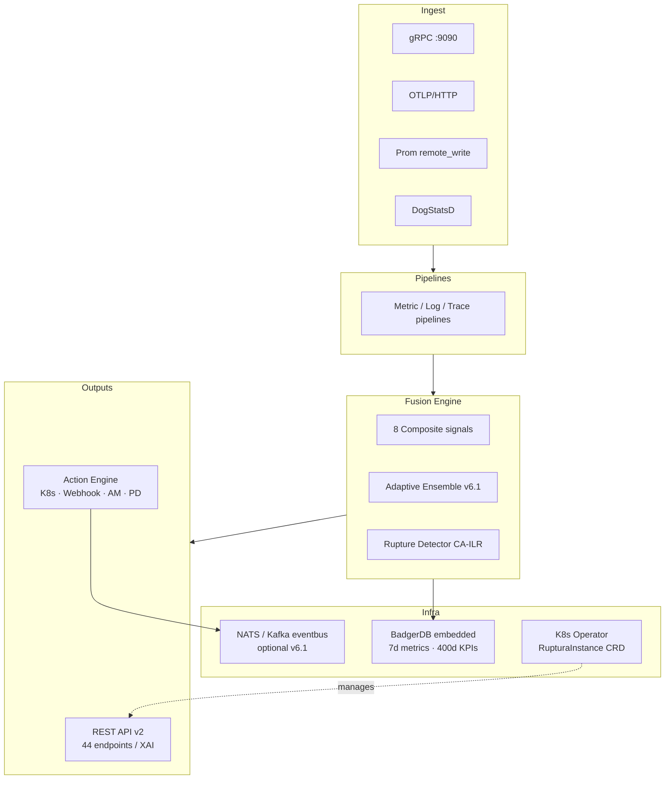

# Architecture

Ruptura ships as a **single Go binary** with BadgerDB embedded — no external database, no sidecar, no agent fleet required.

## System diagram

## Packages

| Package | Responsibility |
|---------|---------------|
| `cmd/ruptura` | Binary entry point, flag parsing |
| `internal/ingest` | OTLP, gRPC, DogStatsD receivers |
| `internal/pipeline` | Metric / log / trace pipelines |
| `internal/fusion` | Signal fusion, composites, rupture detection |
| `internal/pipeline/metrics` | Adaptive ensemble engine (v6.1) |
| `internal/actions` | Action execution, safety gates |
| `internal/api` | REST API v2 handlers (44 endpoints) |
| `internal/storage` | BadgerDB wrapper, tiered compaction |
| `internal/eventbus` | NATS / Kafka driver (v6.1) |
| `internal/grpcserver` | gRPC ingest server (v6.1) |
| `internal/operator` | RupturaInstance CRD reconciler (v6.1) |
| `internal/explain` | XAI trace generation |
| `pkg/rupture` | Rupture Index™ core maths |
| `pkg/composites` | Composite signal formulas |
| `sdk/go` | Official Go client (`ohe` package) |
| `sdk/python` | Official Python client (`ruptura-client`) |

## Detailed pages

- [Pipelines →](pipelines.md)
- [Fusion Engine →](fusion-engine.md)
- [Kubernetes Operator →](operator.md)
