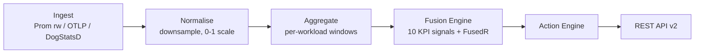

# Pipelines

Ruptura runs three independent ingestion pipelines — metrics, logs, and traces — that feed the fusion engine and produce the Fused Rupture Index per Kubernetes workload.

## Pipeline flow



## WorkloadRef treatment unit

Ruptura extracts Kubernetes resource attributes from OTLP telemetry and groups all signals by **workload** (`namespace/kind/name`), not by host. When multiple pods from the same Deployment send metrics, they are merged into a single workload health view using per-signal aggregation rules (max stress, min health_score, etc.).

For non-Kubernetes ingest (bare-metal, VMs), workloads degrade gracefully to `default/host/{host.name}`.

## Metric pipeline

| Source | Endpoint / Port |
|--------|----------------|
| Prometheus remote_write | `POST http://ruptura:8080/api/v2/write` |
| OTLP/HTTP metrics | `POST http://ruptura:4317/v1/metrics` |
| DogStatsD | UDP `:8125` |
| gRPC | `:9090` |

**Processing steps:**

1. **Parse** — decode protobuf (Prometheus), OTLP proto, or StatsD format
2. **Extract WorkloadRef** — read `k8s.namespace.name`, `k8s.deployment.name`, etc. from OTLP resource attributes
3. **Normalise** — scale all values to `[0, 1]` per metric type
4. **Downsample** — reduce to 15-second granularity for ILR inputs
5. **Window** — maintain rolling 5-min (burst) and 60-min (stable) ILR windows per workload
6. **Compute KPIs** — run all 10 signal formulas and update the workload snapshot
7. **Fuse** — compute `metricR` and call `fusion.SetMetricR(workloadKey, r)`

## Log pipeline

| Source | Endpoint |
|--------|---------|
| OTLP/HTTP logs | `POST http://ruptura:4317/v1/logs` |

**Processing steps:**

1. **Parse** — decode OTLP log records
2. **Classify** — count positive (info/debug) and negative (error/warn) lines per workload
3. **Sentiment** — call `UpdateSentiment(workloadKey, nPos, nNeg)` → contributes to `mood` and `sentiment` signals
4. **BurstDetector** — maintain rolling error/warn baseline; fire `BurstEvent` when rate > 3σ
5. **LogR** — `r_log = burst_rate / log_baseline`
6. **Fuse** — `fusion.SetLogR(workloadKey, r_log)`

## Trace pipeline

| Source | Endpoint |
|--------|---------|
| OTLP/HTTP traces | `POST http://ruptura:4317/v1/traces` |

**Processing steps:**

1. **Parse** — decode OTLP trace spans
2. **Build topology** — extract parent/child relationships to build the service dependency graph
3. **Compute edge weights** — call volume and error rate per service-to-service edge
4. **TopologyBuilder** — inject updated graph into analyzer via `SetTopology()`; enables real graph-based contagion
5. **TraceR** — `r_trace = span_error_rate × (p99_latency / latency_baseline)`
6. **Fuse** — `fusion.SetTraceR(workloadKey, r_trace)`

## OTLP port clarification

!!! important
    OTLP goes to port **4317** (separate OTLP HTTP server).
    Port **8080** is the REST API. POSTing to `/api/v2/v1/{metrics,logs,traces}` on port 8080 returns `421 Misdirected Request` with a message directing you to port 4317. This is intentional — one protocol per port.

## Back-pressure

The ingest server enforces a token-bucket rate limit (default 1000 req/s, configurable via `RUPTURA_INGEST_RPS`). When exceeded, returns `429 Too Many Requests` with `Retry-After: 1`.

The gRPC ingest server returns `RESOURCE_EXHAUSTED` when the internal metric queue is full.

## Eventbus integration

When `eventbus.driver` is set to `nats` or `kafka`, every processed rupture state change is published in addition to being stored:

```
ruptura.rupture.{workload}  →  on every FusedR state change
ruptura.actions.tier1       →  on every Tier-1 action
```

Configure in `ruptura.yaml`:

```yaml
eventbus:
  driver: kafka
  kafka:
    brokers: ["kafka:9092"]
    topic: ruptura.events
```
