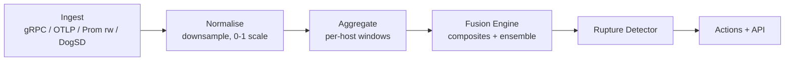

# Pipelines

Ruptura runs three independent ingestion pipelines — metrics, logs, and traces — that feed a shared fusion engine.

## Pipeline flow



## Metric pipeline

Receives metrics from any of:

| Source | Endpoint / Port |
|--------|----------------|
| Prometheus remote_write | `POST /api/v2/write` |
| OTLP/HTTP | `POST /api/v2/v1/metrics` |
| gRPC (v6.1) | `:9090` |
| DogStatsD | UDP `:8125` |

**Processing steps:**

1. **Parse** — decode protobuf (Prometheus), OTLP proto, or StatsD format
2. **Normalise** — scale all values to `[0, 1]` per metric type
3. **Downsample** — reduce to 15-second granularity for ILR inputs
4. **Window** — maintain rolling 5-min (burst) and 60-min (stable) windows per host

## Log pipeline

Receives logs from:

| Source | Endpoint |
|--------|---------|
| OTLP/HTTP | `POST /api/v2/v1/logs` |
| REST push | `POST /api/v2/logs` |

Logs feed the `entropy` and `sentiment` composite signals. Error-rate extraction drives the `contagion` signal.

## Trace pipeline

Receives distributed traces from:

| Source | Endpoint |
|--------|---------|
| OTLP/HTTP | `POST /api/v2/v1/traces` |

Span error rates and latency percentiles feed the `stress` and `pressure` signals.

## Back-pressure (gRPC ingest)

The gRPC ingest server (v6.1) enforces:

- **Max message size:** 4 MB
- **Back-pressure:** if the internal metric queue is full, the server returns `RESOURCE_EXHAUSTED`

This prevents a metrics storm from overwhelming the fusion engine.

## Eventbus integration (v6.1)

When `eventbus.driver` is set to `nats` or `kafka`, every processed rupture event is published in addition to being stored:

```
ruptura.rupture.{host}  →  published on every R state change
ruptura.actions.tier1   →  published when a Tier-1 action fires
```

Configure in `ruptura.yaml`:

```yaml
eventbus:
  driver: kafka
  kafka:
    brokers: ["kafka:9092"]
    topic: ruptura.events
```
