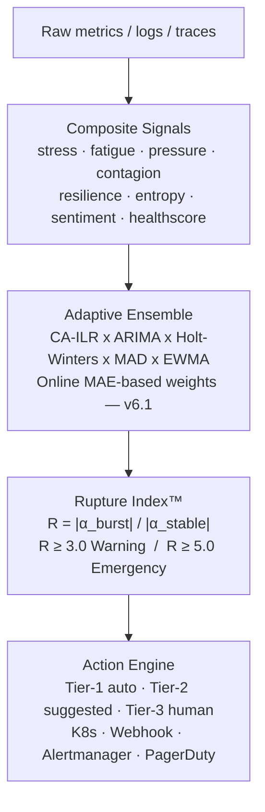

# Concepts

Kairo Core is built around three layered ideas: **predict**, **explain**, **act**.

## Core model

## Concept pages

| Page | What it covers |
|------|---------------|
| [Rupture Index™](rupture-index.md) | The core prediction metric — dual-scale CA-ILR maths |
| [Composite Signals](composite-signals.md) | The 8 interpretable signals and their formulas |
| [Surge Profiles / Adaptive Ensemble](surge-profiles.md) | How model weights adapt online to your traffic patterns |
| [Action Engine](action-engine.md) | Tier system, safety gates, supported integrations |
