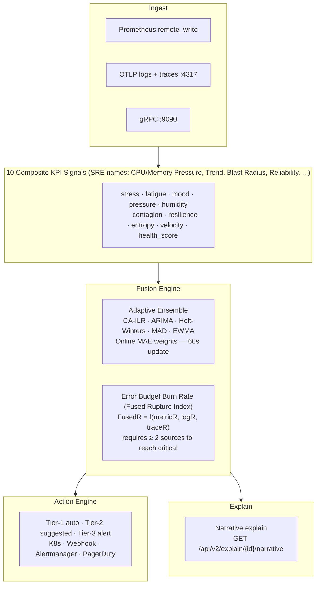

# Concepts

Ruptura is built around three layered ideas: **predict**, **explain**, **act**.

## The big picture

Traditional observability reacts to symptoms — CPU crossed 80%, error rate spiked, latency breached an SLO. By then, users are already affected.

Ruptura measures *divergence from normal* in real time across three independent signal sources (metrics, logs, traces), fuses them into a single Error Budget Burn Rate (internally: rupture index) per Kubernetes workload, and acts before the symptom manifests. Every decision is auditable — the formulas are published, the model weights are observable via API, and every rupture comes with a human-readable causal narrative.

The dashboard, alert rules, and this documentation lead with SRE-standard vocabulary — Reliability, CPU/Memory Pressure, Blast Radius, Error Budget Burn Rate, Incident Probability — with Ruptura's internal signal names (the ones you'll see in API responses and Prometheus labels) in parentheses. See [Composite Signals](composite-signals.md#signal-overview) for the full mapping.

## Core model

## Signal pipeline in one sentence

> Raw telemetry → 10 KPI signals (per-workload adaptive baselines) → 5-model ensemble fusion → Fused Rupture Index → tiered action with safety gates → causal narrative.

## Concept pages

| Page | What it covers |
|------|---------------|
| [Rupture Index™](rupture-index.md) | The core prediction metric — dual-scale CA-ILR maths, three-source fusion |
| [Composite Signals](composite-signals.md) | All 10 KPI signals with formulas, calibration warm-up, and HealthScore forecast |
| [Surge Profiles / Adaptive Ensemble](surge-profiles.md) | How the 5-model ensemble adapts online to your traffic patterns |
| [Action Engine](action-engine.md) | Tier system, safety gates, edition gate, K8s and webhook integrations |
| [Fingerprinting & Business Signals](fingerprinting.md) | Pattern matching across past ruptures + SLO burn velocity, blast radius, recovery debt |
