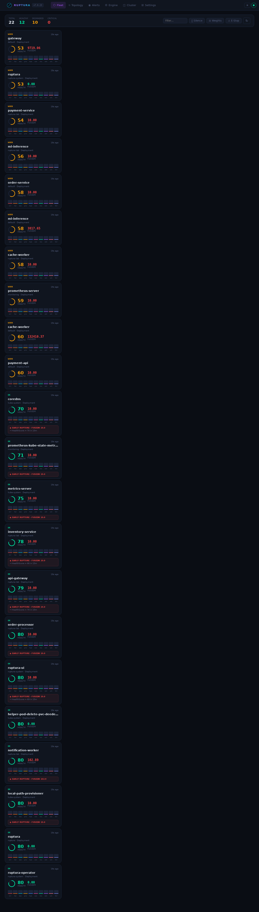
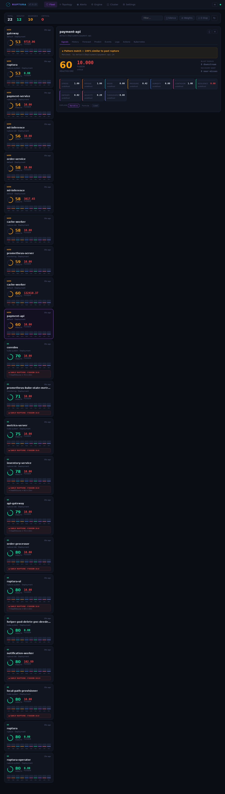
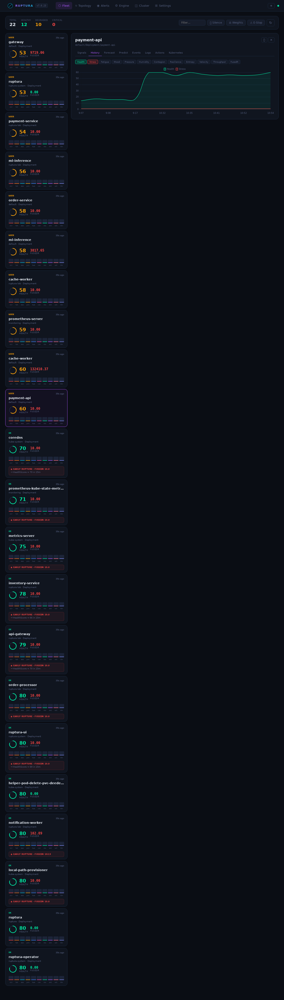
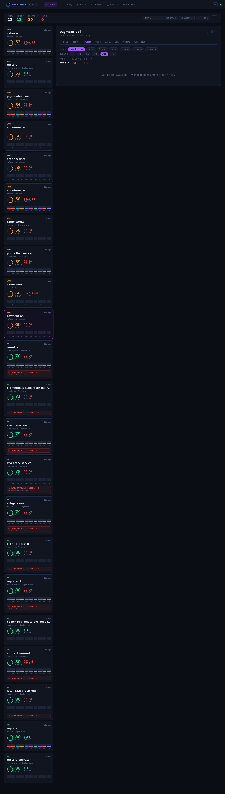
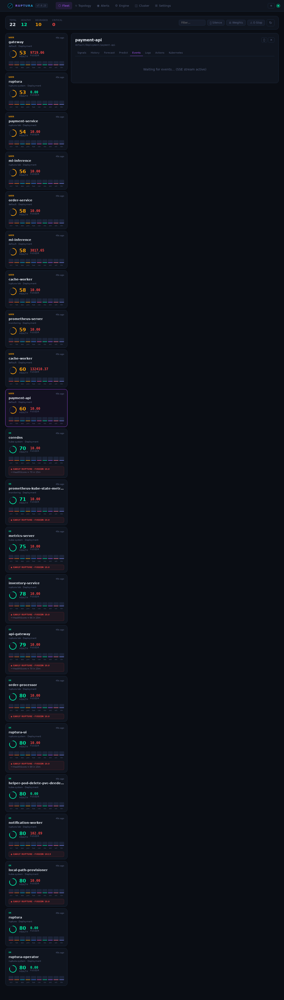
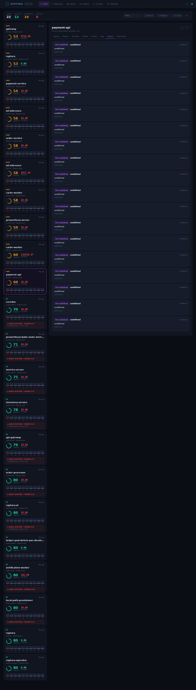
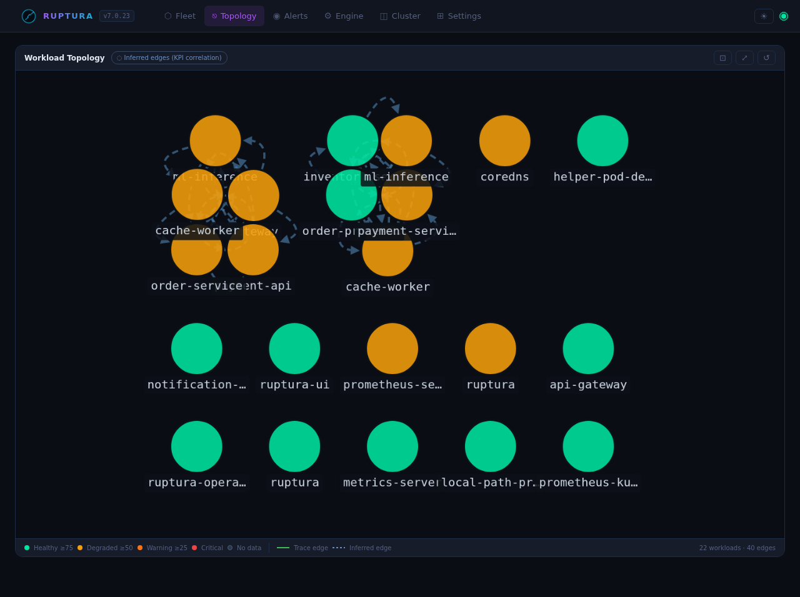
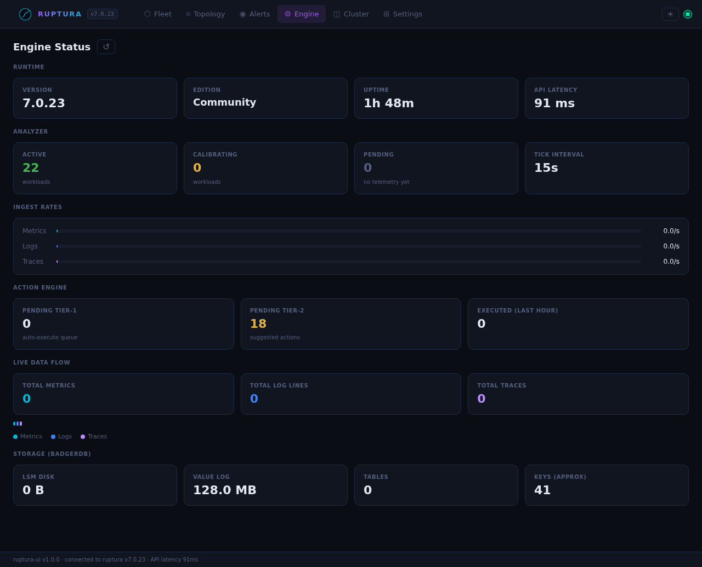
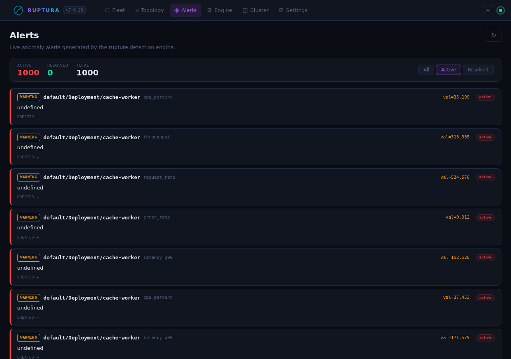
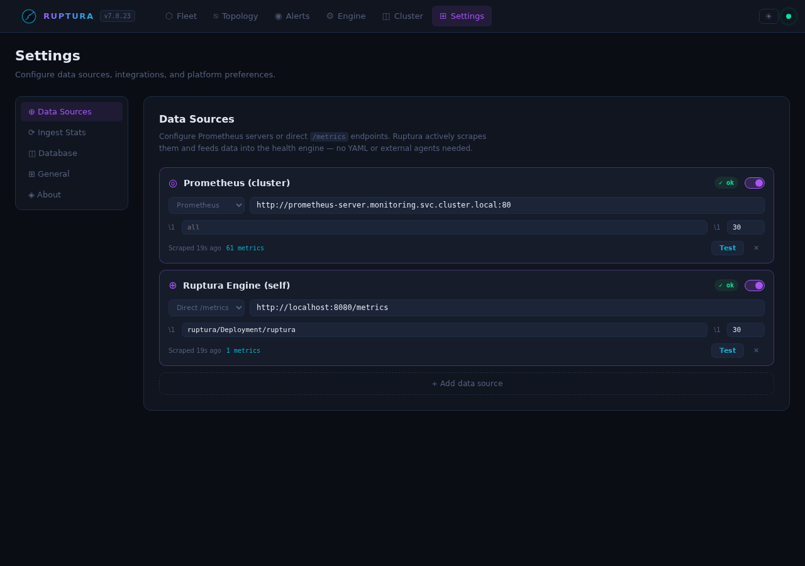

# Dashboard Tour

Ruptura v7 ships a Svelte 4 SPA at `http://<node-ip>:31469`. Below is a full walkthrough grounded in the **live lab** running at [185.229.225.115:31469](http://185.229.225.115:31469) — five synthetic workloads are active and the engine is fully calibrated.

---

## Workload lifecycle phases

Every workload passes through three phases. Understanding them is key to reading the UI correctly.

### Phase 1 — Calibrating

```
status: "calibrating"   calibration_progress: 45   calibration_eta_minutes: 13
```

When Ruptura first sees a workload it needs roughly **30 minutes of history** to build adaptive baselines (Welford online statistics per metric). During calibration:

- The health ring shows the current raw KPI value but is bordered in **gray**
- A progress bar and ETA appear under the workload name: `Calibrating… 45% · ~13 min`
- FusedR is computed but **rupture alerts are suppressed** — a single noisy startup spike will not page anyone
- All 10 signals are visible and updating every 15 s

This is the correct behavior. Ruptura is learning what "normal" looks like for this specific workload before it starts predicting.

### Phase 2 — Active (alerting enabled)

```
status: "active"   rupture_detection: "active"
```

Once calibration completes, the full prediction stack activates:

- Health ring border turns **green / yellow / red** based on FusedR
- `⚠ Critical in ~12m` warning appears when the HealthScore forecast is heading toward critical
- Ruptures fire when FusedR ≥ 1.5 (Warning), 3.0 (Critical), or 5.0 (Emergency)
- Pattern-match warnings appear if the current KPI vector matches a prior rupture (cosine similarity ≥ 0.85)

### Phase 3 — Rupture

```
fused_rupture_index: 21.97   state: "critical"   health_score: 16.63
```

A confirmed rupture means FusedR crossed a threshold and stayed there. The card turns red, a rupture event is logged in the Events tab, and the action engine evaluates whether to suggest or automatically execute a remediation. The live lab currently shows `payment-api` in this state.

---

## Fleet view



The Fleet page is your top-level situational awareness view. Each card shows:

| Element | What it means |
|---------|--------------|
| **Health ring** | Current HealthScore (0–100). Color: green ≥ 70, yellow 40–70, red < 40 |
| **10 signal mini-bars** | One bar per KPI, height = normalized value. Red bar = critical signal |
| **FusedR badge** | Composite rupture score. Gray = calibrating, green < 1.5, yellow 1.5–3.0, orange 3.0–5.0, red ≥ 5.0 |
| **Calibration progress** | Gray progress bar + ETA during Phase 1 |
| **`⚠ Critical in ~Xm`** | HealthScore forecast heading toward critical — appears when `critical_eta_minutes` is set |

Live lab fleet state (from the running engine):

```
payment-api     critical   HealthScore  16.6   FusedR  21.97   stress=panic  fatigue=burnout  contagion=pandemic
order-service   critical   HealthScore  18.2   FusedR   9.18   stress=panic  fatigue=burnout
gateway         critical   HealthScore  26.7   FusedR 349.94   stress=panic  fatigue=burnout
cache-worker    critical   HealthScore  28.0   FusedR 2842     stress=panic  fatigue=burnout
ml-inference    critical   HealthScore  17.8   FusedR 131.85   calibrating
```

The SSE live rupture counter in the header updates in real time without polling.

---

## Workload detail — Signals tab



Click any card to open the detail drawer. The **Signals** tab shows all 10 KPI gauges with their current value and state name.

### Signal states — full vocabulary

Each signal has a set of named states that go beyond simple ok/warning/critical:

**Stress** (CPU + latency burst)
| Value | State | Meaning |
|-------|-------|---------|
| 0.0–0.3 | `calm` | Normal load |
| 0.3–0.6 | `nervous` | Elevated but manageable |
| 0.6–0.85 | `stressed` | Sustained high load |
| 0.85–1.0 | `panic` | Maximum stress — CPU pegged, latency spiking |

**Fatigue** (long-term wear)
| Value | State | Meaning |
|-------|-------|---------|
| 0.0–0.3 | `fresh` | No accumulated load history |
| 0.3–0.6 | `tired` | Some sustained load in history |
| 0.6–0.85 | `exhausted` | Extended high load period |
| 0.85–1.0 | `burnout` | At maximum accumulated deviation — recovery needed |

**Mood** (log sentiment)
| Value | State | Meaning |
|-------|-------|---------|
| 0.7–1.0 | `happy` | Mostly info/debug logs |
| 0.4–0.7 | `neutral` | Mixed log levels |
| 0.1–0.4 | `unhappy` | Warn-heavy log stream |
| 0.0–0.1 | `depressed` | Error/warn dominant — application distressed |

**Contagion** (cross-service propagation)
| Value | State | Meaning |
|-------|-------|---------|
| 0.0–0.2 | `contained` | No error spreading |
| 0.2–0.5 | `spreading` | Error propagating to 1–2 upstreams |
| 0.5–0.8 | `epidemic` | Multiple upstream services affected |
| 0.8–1.0 | `pandemic` | Fleet-wide cascade — critical |

**Resilience** (recovery capacity)
| Value | State | Meaning |
|-------|-------|---------|
| 0.7–1.0 | `strong` | Recovers quickly from spikes |
| 0.4–0.7 | `recovering` | Moderate recovery speed |
| 0.1–0.4 | `fragile` | Slow to recover |
| 0.0–0.1 | `critical` | No recovery buffer — next spike will cascade |

**Pressure** (memory + disk saturation): `comfortable` → `rising` → `heavy` → `critical`

**Humidity** (forecast variance): `dry` (predictable) → `humid` → `stormy` (chaotic, high variance)

**Entropy** (signal disorder): `ordered` → `mixed` → `chaotic`

**Velocity** (request rate acceleration): `steady` → `accelerating` → `surging`

**Throughput** (data volume): `low` → `normal` → `high` → `flood`

### Live example: payment-api in rupture

From the running lab:

```
stress:     1.000  panic       CPU pegged from error retry storms
fatigue:    1.000  burnout     72+ minutes of sustained load
mood:       0.000  depressed   error rate at maximum
pressure:   0.432  improving   memory pressure easing slightly
contagion:  1.000  pandemic    error wave spreading to dependents
resilience: 0.000  critical    no recovery buffer remaining
humidity:   0.000  dry         behavior is predictably bad
entropy:    0.023  ordered     deterministic failure, not random
velocity:   0.013  steady      rate of change is stable (plateau)
health:    18.52   critical

FusedR: 21.97  →  Emergency tier
```

The combination of `burnout + pandemic + critical resilience` is the signature of a cascade rupture that is self-sustaining.

### Live example: inventory-service (degraded, building)

```
stress:     0.182  calm        low CPU usage
fatigue:    0.000  fresh       recent deployment
pressure:   rising             memory slowly climbing (leak pattern)
resilience: strong             not yet stressed enough to lose buffer
health:    67.94   degraded

FusedR: 2.056  →  Warning tier — trending toward Critical
```

This is the early-warning phase. FusedR is 2.0 and rising — Ruptura will alert before this crosses 3.0.

---

## History tab



Time-series chart for any signal over the workload's stored history. Toggle signal chips to overlay multiple signals. Useful for:

- **Slow-burn detection**: flat stress but rising fatigue over hours
- **Cascade timing**: see the exact tick where contagion jumped
- **Recovery confirmation**: resilience recovering after an action was applied

---

## Forecast tab



Projects HealthScore +15 and +30 minutes using the 5-model ensemble (CA-ILR, ARIMA, Holt-Winters, MAD, EWMA). When the trajectory is heading toward critical, `critical_eta_minutes` is populated and `⚠ Critical in ~Xm` appears on the card.

The ensemble weights are re-computed every 60 s based on each model's mean absolute error over the past hour. No manual tuning needed — the models that predicted well get more vote.

---

## Predictions tab

Per-metric model outputs: each of the 5 models shows its current prediction and its current weight. Useful for debugging why a particular workload's FusedR is behaving unexpectedly.

---

## Events tab



Live SSE rupture/recovery log. Each entry includes:
- Timestamp
- FusedR at trigger time
- Which threshold was crossed (Warning / Critical / Emergency)
- Which signals were primary drivers

---

## Actions tab



Tier-2 actions (FusedR 3.0–5.0) appear here for human approval. Each action shows:
- Recommended action (scale / restart / cordon)
- Confidence score
- Approve / Reject buttons

Tier-1 actions (FusedR ≥ 5.0) execute automatically if the `autopilot` edition is enabled.

**Emergency stop**: A dedicated button sends `POST /api/v2/actions/emergency-stop` — immediately halts all automated Tier-1 execution.

---

## Topology view



Service dependency graph from OTLP trace spans. Only populated when OTLP traces are flowing.

- **Click a node** → health bar + current FusedR
- **Click an edge** → call rate, error rate, P99 latency for that service pair

The graph builds automatically from span data — no configuration needed.

---

## Engine view



Ruptura runtime diagnostics:

| Metric | What it shows |
|--------|--------------|
| Tracked workloads | Total workloads with active signal history |
| Analyzer state | Last tick time, interval |
| Ingest rates | metrics/s, logs/s, traces/s, parse errors |
| BadgerDB | Storage size, GC stats, TTL compaction |

Live engine health check:

```json
{
  "status": "online",
  "version": "7.0.23",
  "edition": "community",
  "uptime_seconds": 644,
  "rupture_detection": "active",
  "message": "Running — building signal history"
}
```

---

## Cluster / Nodes view

K8s node health from the k8smetrics poller: CPU, memory, disk pressure per node. Useful for spotting when a node's resource pressure is causing pod evictions (the root cause of the most common scheduling failures).

---

## Alerts view



Live alert feed from the anomaly detectors. Each alert shows:

```
host:     ruptura-lab/Deployment/notification-worker
metric:   fatigue
value:    6.0   (expected: 0.5)
score:    7.42  (MAD anomaly score)
method:   mad
severity: warning
```

Two independent detectors must agree before an alert becomes `critical`. This eliminates most false positives.

---

## Settings

### Datasources tab



Currently active in the lab:

```
prometheus-cluster   Prometheus (cluster)   scraping every 30s   59 metrics/tick
self-ruptura-metrics Ruptura Engine (self)  scraping every 30s    1 metric/tick
```

Register a Prometheus or OTLP datasource. OTLP datasources bypass SSRF validation (the URL is Ruptura's own push endpoint). Click **Test** to TCP-dial the endpoint.

### Ingest Stats tab

Live totals: metrics received, logs received, traces received, parse errors, active workloads.

### Database tab

Per-signal-type retention (days), plus purge controls:
- **Purge by type** — delete all data for a signal type
- **Purge by date** — delete data older than a given date
- **Purge all** — full data reset (confirmation required)

---

## Quick install

```bash
helm install ruptura oci://ghcr.io/benfradjselim/charts/ruptura \
  --namespace ruptura-system \
  --create-namespace \
  --set apiKey=$(openssl rand -hex 32) \
  --set ui.enabled=true \
  --set ui.service.type=NodePort

# Dashboard:   http://<node-ip>:31469/
# Engine API:  http://<node-ip>:31468/api/v2/health
# OTLP ingest: http://<node-ip>:31470/api/v2/write
```

Inject synthetic workloads immediately:

```bash
python3 scripts/simulate.py
# 5 workloads, 5 s interval:
#   gateway        — stable/healthy
#   order-service  — slow-burn CPU stress (45→90% over 10 min)
#   payment-api    — error bursts every 2 min (8→43% error rate)
#   cache-worker   — traffic spikes every 3 min (up to 2800 req/s)
#   ml-inference   — noisy/calibrating new workload
```

All workloads will calibrate within ~30 minutes and full rupture detection activates automatically.
