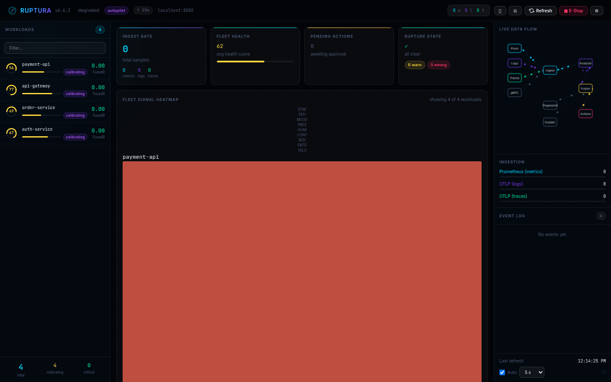
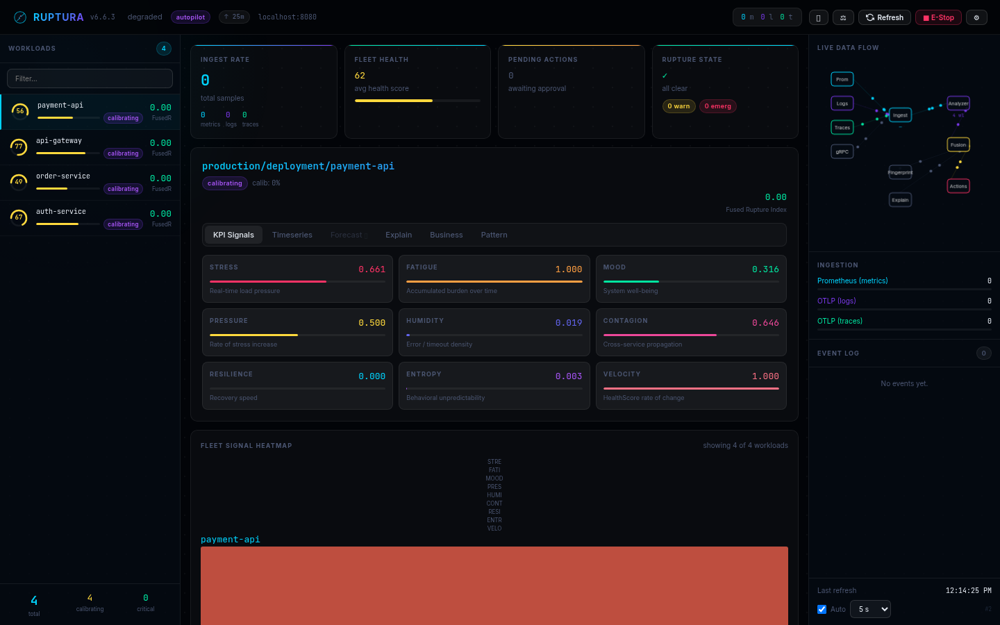
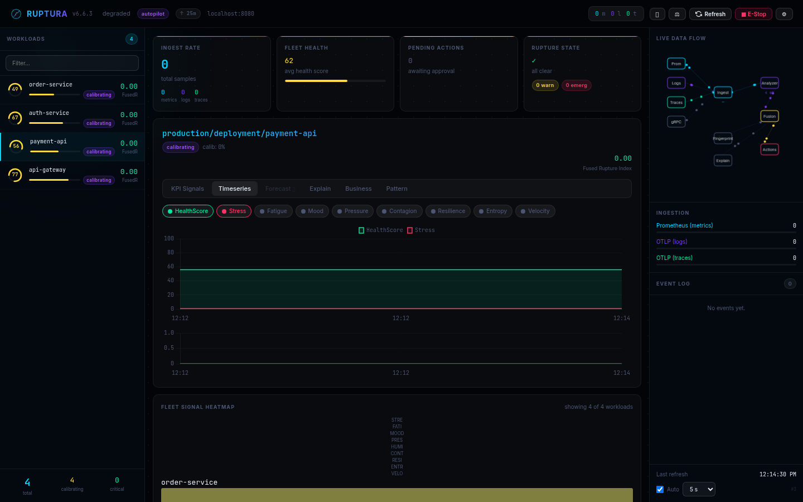
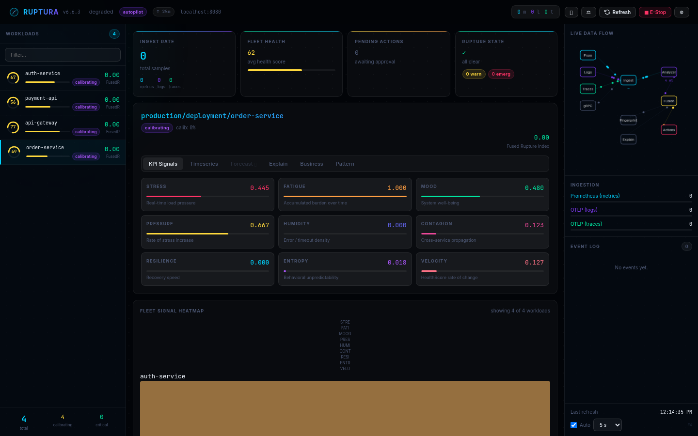

# Dashboard Tour

Ruptura ships a self-contained web UI served at `http://<host>:8080`. No Grafana, no external tools — open a browser and it's ready. The screenshots below were captured from a live instance with four synthetic workloads running simultaneously.

---

## Fleet overview

When you first open the dashboard you see the full fleet at a glance.



**What you're looking at:**

| Area | What it shows |
|------|--------------|
| **Sidebar** | Every tracked workload with its HealthScore circle and FusedR badge. Colour transitions from green → yellow → red as health degrades. |
| **Fleet Health card** | Average HealthScore across all workloads — 62 here, flagged as `degraded`. |
| **Pending Actions** | Actions waiting for human approval (Tier-2). |
| **Rupture State** | Current highest-severity state across the fleet. |
| **Live Data Flow** | Animated pipeline diagram — Prom → Logs → Traces → Ingest → Analyze → Fusion → Fingerprint → Actions → Explain. |
| **Heatmap** | 10 KPI signals × all workloads, colour-coded by value. |

The status bar at the bottom shows `4 total · 4 calibrating · 0 critical`. During the first calibration window signals are computed and stored but rupture predictions are suppressed — `calibrating` badges appear on each workload.

---

## KPI signals — per-workload breakdown

Click any workload to drill into its signal panel. This is `production/deployment/payment-api` running a cascade-failure pattern:



The 9 gauge cards map directly to Ruptura's composite signal formulas:

| Signal | Value | Meaning |
|--------|-------|---------|
| **STRESS** | 0.661 🔴 | High real-time load — CPU, RAM, latency, errors accumulating |
| **FATIGUE** | 1.000 🔴 | Stress has been sustained long enough to push to maximum burnout |
| **MOOD** | 0.316 | System well-being low — throughput vs error ratio degraded |
| **PRESSURE** | 0.500 🟡 | Rate-of-change of stress rising — storm building |
| **CONTAGION** | 0.646 🔴 | Cross-service propagation — error wave spreading from payment-db |
| **VELOCITY** | 1.000 🔴 | HealthScore degrading at maximum rate |
| **RESILIENCE** | 0.000 | No recovery capacity — fatigue + contagion have consumed it |
| **HUMIDITY** | 0.019 | Error/timeout density low despite high stress (cascade not yet error-heavy) |
| **ENTROPY** | 0.003 | Behavior is predictably bad, not chaotic |

Fatigue at 1.000 + Velocity at 1.000 + Resilience at 0.000 is the signature of a workload approaching a hard failure — it has been under sustained load, it is getting worse fast, and it has no buffer left to absorb further spikes.

---

## Timeseries — signal history

Switch to the **Timeseries** tab to see how signals evolved over time:



The chart shows **HealthScore** (green, 0–100 scale) and **Stress** (red, 0–1 scale) over the last ~2 minutes. Toggle any of the 9 signal chips at the top to overlay them. The HealthScore line holds flat early while the sim ramps up, then drops sharply — this is the cascade pattern taking hold.

---

## Comparing workloads — slow-burn vs cascade

Here is `production/deployment/order-service` running a slow-burn pattern side-by-side for comparison:



| Signal | payment-api (cascade) | order-service (slow-burn) |
|--------|----------------------|--------------------------|
| STRESS | 0.661 🔴 | 0.445 🟡 |
| FATIGUE | 1.000 🔴 | 1.000 🔴 |
| PRESSURE | 0.500 🟡 | 0.667 🟡 |
| CONTAGION | 0.646 🔴 | 0.123 |
| VELOCITY | 1.000 🔴 | 0.127 |

The slow-burn signature: fatigue reaches maximum (sustained load over time) but velocity stays low (degradation is gradual, not accelerating) and contagion is minimal (self-contained, no cascade). The cascade signature is the opposite: high contagion + maximum velocity — a fast, spreading failure.

---

## Running this yourself

Start a local Ruptura instance and inject a simulation pattern in under a minute:

```bash
# Start Ruptura
docker run -d --name ruptura -p 8080:8080 \
  ghcr.io/benfradjselim/ruptura:6.7.0

# Open the dashboard
open http://localhost:8080

# Inject a cascade-failure pattern
ruptura-sim inject \
  --pattern cascade-failure \
  --workload production/deployment/payment-api \
  --origin production/deployment/payment-db \
  --target http://localhost:8080 \
  --duration 10m
```

Add more patterns in parallel to see how the fleet heatmap fills up and the fleet health score drops across multiple workloads simultaneously.

Available patterns: `cascade-failure` · `memory-leak` · `traffic-surge` · `slow-burn`

```bash
ruptura-sim patterns
```

→ Full reference: [Embedded Dashboard →](../architecture/dashboard.md)
